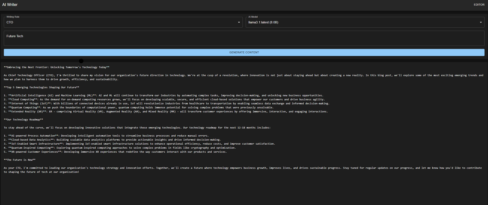

# AI Writer



## Overview
AI Writer is a modern writing assistant that leverages Ollama's language models to help users generate high-quality content. Built with Next.js and Tailwind CSS, it provides a sleek interface for real-time content generation with customizable writing styles.

## Features
- Real-time text generation with streaming responses
- Multiple writing styles:
  - Professional
  - Casual
  - Technical
  - Creative
- Monaco-based text editor with syntax highlighting
- Dark/Light theme support
- Responsive design for all devices
- Markdown support with live preview

## Technical Architecture

### Frontend
- Next.js 13
- Tailwind CSS for styling
- Monaco Editor for text editing
- Server-sent events for streaming

### Backend
- Express.js server
- Ollama API integration
- Streaming response handling
- Custom prompt management

## Getting Started

### Prerequisites
- Node.js (v16 or higher)
- Ollama installed and running
- Git

### Installation
1. Clone the repository:
   ```bash
   git clone [repository-url]
   cd ai-writer
   ```

2. Install dependencies:
   ```bash
   # Install client dependencies
   cd client
   npm install

   # Install server dependencies
   cd ../server
   npm install
   ```

3. Configure environment:
   ```bash
   # In client directory
   cp .env.example .env.local

   # In server directory
   cp .env.example .env
   ```

4. Start the development servers:
   ```bash
   # Start backend (from server directory)
   npm run dev

   # Start frontend (from client directory)
   npm run dev
   ```

## Usage Guide

### Basic Usage
1. Select a writing style from the dropdown
2. Enter your topic or initial prompt
3. Click "Generate" to start content generation
4. Edit the generated content in real-time
5. Use the formatting toolbar for text styling

### Writing Styles
- **Professional**: Clear, formal business writing
- **Casual**: Friendly, conversational tone
- **Technical**: Detailed, precise technical content
- **Creative**: Engaging, imaginative writing

### Features
- Real-time content streaming
- Markdown formatting
- Copy to clipboard
- Word count tracking
- Auto-save drafts

## API Reference

### Endpoints

#### Generate Content
```http
POST /api/generate
Content-Type: application/json

{
  "prompt": "string",
  "style": "string",
  "length": "string"
}
```

Response: Server-sent events stream

### Configuration

#### Environment Variables
- `NEXT_PUBLIC_API_URL`: Backend API URL
- `OLLAMA_API_URL`: Ollama API endpoint
- `OLLAMA_MODEL`: Model name to use

## Development

### Project Structure
```
ai-writer/
├── client/
│   ├── components/
│   │   ├── Editor.js
│   │   ├── StyleSelector.js
│   │   ├── Toolbar.js
│   │   └── Preview.js
│   ├── pages/
│   │   └── index.js
│   └── styles/
│       └── globals.css
├── server/
│   ├── routes/
│   │   └── api.js
│   ├── services/
│   │   └── ollama.js
│   └── server.js
└── docs/
```

### Adding New Features
1. Create components in `client/components`
2. Add API routes in `server/routes`
3. Update documentation
4. Test thoroughly

## Troubleshooting

### Common Issues
1. **Generation Not Starting**
   - Check Ollama service status
   - Verify API endpoint configuration
   - Check network connectivity

2. **Streaming Issues**
   - Check server-sent events connection
   - Verify browser compatibility
   - Check network stability

3. **Editor Problems**
   - Clear browser cache
   - Check Monaco Editor initialization
   - Verify content format

## Contributing
1. Fork the repository
2. Create a feature branch
3. Make your changes
4. Submit a pull request

## License
MIT License - See LICENSE file for details 