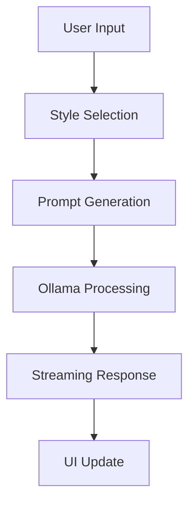
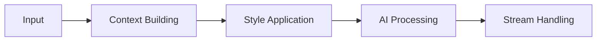
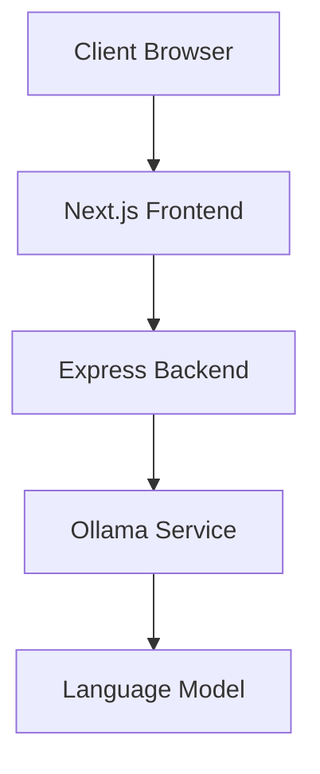

# AI Writer Architecture

## Overview
AI Writer is a modern writing assistant built with Next.js and Express that leverages Ollama's language models to generate high-quality content with customizable writing styles.

## System Architecture

### Frontend (Next.js)
- **Core Components**:
  - Monaco-based text editor
  - Style selector
  - Toolbar with formatting options
  - Preview panel with markdown rendering
  - Theme switcher (dark/light)

- **State Management**:
  - React hooks for local state
  - Real-time content updates
  - Writing style context
  - Theme context

### Backend (Express)
- **API Endpoints**:
  - `/api/generate`: Content generation
  - `/api/styles`: Writing style management
  - `/api/health`: Service health check

- **Services**:
  - Ollama integration
  - Prompt management
  - Server-sent events
  - Style templates

## Data Flow

### 1. Content Generation

### 2. Processing Pipeline

## Technical Stack

### Frontend
- Next.js 13
- Tailwind CSS
- Monaco Editor
- Server-sent events
- TypeScript

### Backend
- Express.js
- Node.js
- Ollama integration
- TypeScript

## Security Implementation

### Input Handling
- Content validation
- Style verification
- Rate limiting
- Error boundaries

### Response Management
- Stream validation
- Error handling
- Resource cleanup
- Session management

## Performance Optimizations

### Content Generation
- Debounced input
- Streaming responses
- Efficient state updates
- Memory management

### Editor Performance
- Monaco editor optimization
- Lazy loading
- Efficient re-rendering
- Cache implementation

## Deployment Architecture

## Monitoring and Logging
- Request tracking
- Error logging
- Performance metrics
- Resource utilization

## Future Enhancements
- Collaborative editing
- Template management
- Custom style creation
- Enhanced formatting options
- Export capabilities 