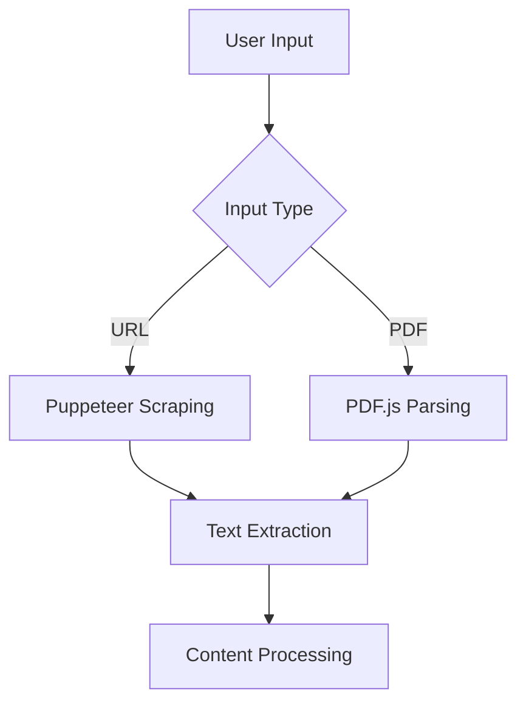
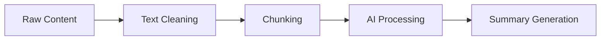
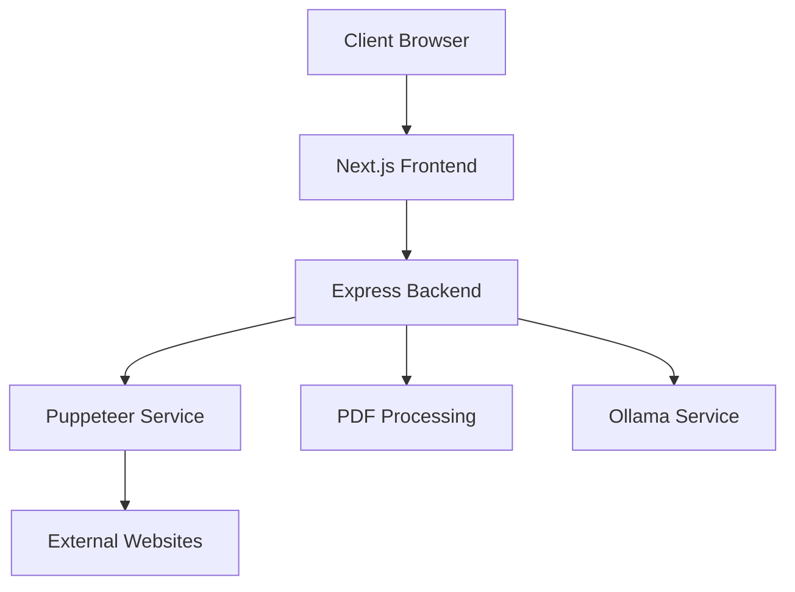

# Content Summarizer Architecture

## Overview
Content Summarizer is a modern web application built with Next.js and Express that extracts and summarizes content from web pages and PDF documents using AI-powered analysis.

## System Architecture

### Frontend (Next.js)
- **Core Components**:
  - URL input with validation
  - PDF file upload with drag-and-drop
  - Summary display with formatting
  - Progress indicators
  - Error handling UI

- **State Management**:
  - React hooks for local state
  - Loading states
  - Error states
  - Progress tracking

### Backend (Express)
- **API Endpoints**:
  - `/api/summarize/url`: Web content summarization
  - `/api/summarize/pdf`: PDF document summarization
  - `/api/health`: Service health check

- **Services**:
  - Puppeteer for web scraping
  - PDF.js for document parsing
  - Ollama for AI summarization
  - Text processing utilities

## Data Flow

### 1. Content Extraction

### 2. Summarization Pipeline

## Technical Stack

### Frontend
- Next.js 13
- Tailwind CSS
- React Drop Zone
- TypeScript
- Server-sent events

### Backend
- Express.js
- Node.js
- Puppeteer
- PDF.js
- Ollama integration

## Security Implementation

### Input Validation
- URL validation and sanitization
- File type verification
- Size limit enforcement
- Content type checking

### Rate Limiting
- Request rate limiting
- Concurrent processing limits
- Resource usage monitoring

### Error Handling
- Graceful failure recovery
- User-friendly error messages
- Logging and monitoring

## Performance Optimizations

### Content Processing
- Parallel processing where possible
- Efficient text chunking
- Memory usage optimization
- Cache implementation

### Response Handling
- Streaming responses
- Progress updates
- Efficient error handling
- Resource cleanup

## Deployment Architecture

## Monitoring and Logging
- Request tracking
- Error logging
- Performance metrics
- Resource utilization

## Future Enhancements
- Additional file format support
- Enhanced summarization options
- Collaborative features
- API rate limiting
- Custom model training 