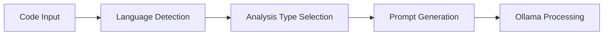
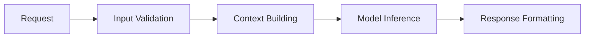
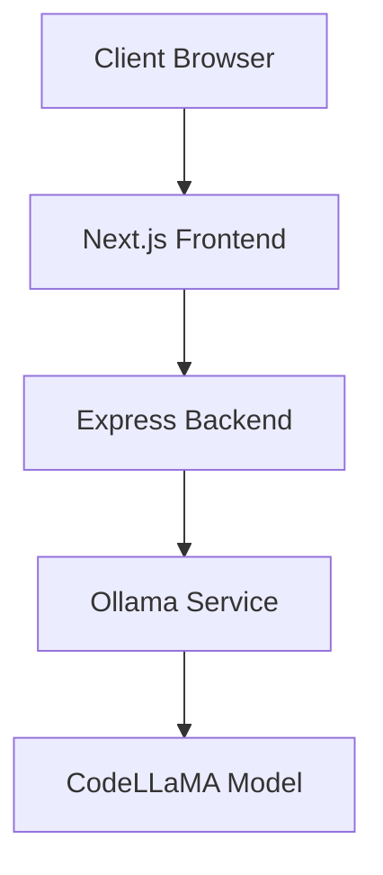

# Code Explainer Architecture

## Overview
Code Explainer is a modern web application that provides intelligent code analysis and documentation generation using Next.js, Express, and CodeLLaMA.

## System Components

### Frontend (Next.js)
- **UI Components**:
  - Monaco Editor for code input
  - Settings controls for analysis options
  - Result display with markdown rendering
  - Responsive layout with Tailwind CSS

- **State Management**:
  - React hooks for local state
  - Real-time code updates
  - Analysis type switching
  - Loading states

### Backend (Express)
- **API Routes**:
  - `/api/explain`: Code explanation endpoint
  - `/api/generate-docs`: Documentation generation
  - `/api/review`: Code review service

- **Services**:
  - Ollama integration for AI processing
  - Language detection
  - Response streaming
  - Error handling

## Data Flow

### 1. Code Input & Analysis

### 2. Processing Pipeline

## Technical Stack

### Frontend
- Next.js 13
- Tailwind CSS
- Monaco Editor
- React
- TypeScript

### Backend
- Express.js
- Node.js
- CodeLLaMA via Ollama
- TypeScript

## Security Measures
- Input sanitization for code snippets
- Rate limiting on API endpoints
- Error boundary implementation
- Secure environment variable handling
- Request validation middleware

## Performance Optimizations
- Code editor debouncing
- Response streaming
- Lazy loading of components
- Efficient state management
- Caching strategies

## Deployment Architecture

## Future Considerations
- WebSocket implementation for real-time collaboration
- Additional language support
- Custom model fine-tuning
- Enhanced caching mechanisms
- Plugin system for extensibility 