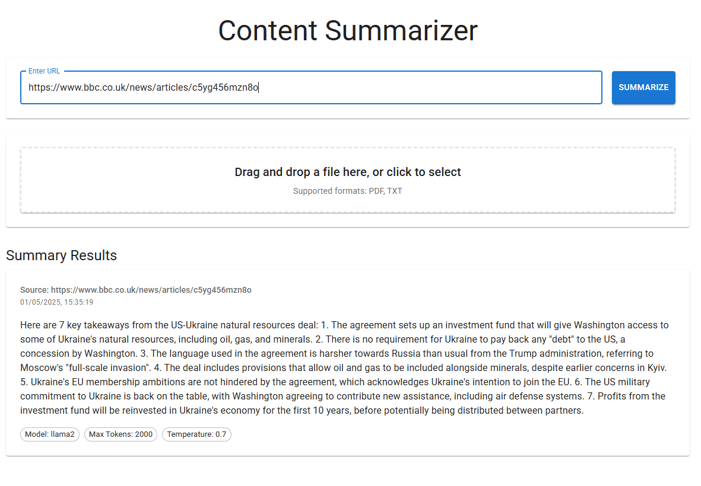
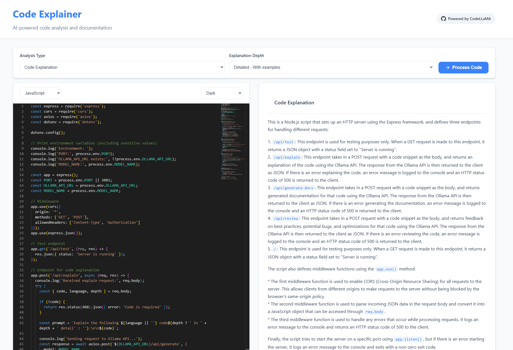

# AI Development Tools

A collection of three powerful AI-powered tools showcasing different aspects of AI and coding capabilities.

## Tools Overview

1. AI Writing Assistant
   
   - Use case: Generate blog posts, emails, meeting notes with customizable writing styles
   - Stack: Next.js frontend with Monaco Editor, Ollama (Mistral) backend
   - Features: Real-time streaming responses, style customization, markdown support
   - [Documentation](01-ai-writer/docs)

2. Content Summarizer
   
   - Use case: Extract and summarize content from URLs or PDFs
   - Stack: Next.js frontend, Express backend with Puppeteer for web scraping
   - Features: URL and PDF processing, customizable summary length, key points extraction
   - [Documentation](02-content-summarizer/docs)

3. Code Explainer
   
   - Use case: Analyze code and generate documentation or explanations
   - Stack: Next.js frontend with Monaco Editor, Express backend with CodeLLaMA
   - Features: Syntax highlighting, multiple documentation styles, code review capabilities
   - [Documentation](03-code-explainer/docs)

## Using Cursor to Generate Projects

### Prerequisites
1. Install [Cursor](https://cursor.sh/)
2. Install [Ollama](https://ollama.ai/)
3. Have Node.js (v16 or higher) installed

### Working with Cursor

1. **Project Setup**
   ```bash
   # Create a new directory for your project
   mkdir ai-tools
   cd ai-tools
   
   # Initialize git repository
   git init
   ```

2. **Core Cursor Features**
   - **Chat (⌘K)**: Your AI pair programmer for complex code changes
   - **Tab Completion**: Smart code completion that learns from your patterns
   - **AI Commands**: Quick inline code editing and generation
   - **Context Awareness**: Understands your codebase for better assistance

3. **Using Cursor's AI Features**
   - Use `⌘K` to open the command palette for AI interactions
   - Use `⌘.` to summon the Cursor Agent for advanced operations
   - Use `@` symbols to reference files, folders, and documentation
   - Use the chat panel for longer discussions and complex tasks

4. **Best Practices with Cursor**
   - Keep conversations focused on specific tasks
   - Provide clear context when asking questions
   - Use project-specific rules in `.cursorrules` file
   - Leverage Notepads for reusable templates and guidelines

### Cursor Rules

The repository includes a set of Cursor rules in `.cursor/rules/` that help guide development and maintain consistency:

1. **Project Structure** (`project-structure.mdc`)
   - Maps the repository organization
   - Documents key files and their purposes
   - Provides navigation references for main components
   - Links to important entry points and components

2. **Coding Standards** (`coding-standards.mdc`)
   - TypeScript and React best practices
   - File naming conventions
   - Code style guidelines
   - API response formats
   - Testing requirements

3. **AI Interactions** (`ai-interactions.mdc`)
   - Guidelines for AI-assisted development
   - Component and endpoint generation standards
   - Documentation requirements
   - Testing specifications
   - AI integration best practices

These rules help Cursor provide more accurate and context-aware assistance. They are automatically applied when:
- Using the chat feature
- Generating code
- Getting completions
- Requesting explanations

### Project Structure Best Practices

1. **Organization**
   - Use clear directory names
   - Group related files together
   - Follow framework conventions
   - Keep configuration files at root level

2. **Code Quality**
   - Write clear, self-documenting code
   - Add comments for complex logic
   - Follow consistent naming conventions
   - Use TypeScript for better type safety

3. **Documentation**
   - Maintain up-to-date README files
   - Document API endpoints
   - Include setup instructions
   - Add usage examples

4. **Version Control**
   - Make atomic commits
   - Write descriptive commit messages
   - Use meaningful branch names
   - Keep .gitignore updated

## Documentation Structure

Each tool has its own documentation directory with the following structure:
- `architecture.md`: System design and technical details
- `setup.md`: Installation and configuration guide
- `usage.md`: User guide and best practices

## Getting Started

1. Choose a tool from the list above
2. Navigate to its documentation directory
3. Follow the setup guide
4. Start using the tool!

## Common Requirements

All tools require:
- Node.js (v16 or higher)
- Ollama installed and running
- Git

## Contributing

Feel free to contribute to any of the tools by:
1. Forking the repository
2. Creating a feature branch
3. Making your changes
4. Submitting a pull request

## License

MIT License - See LICENSE file for details

